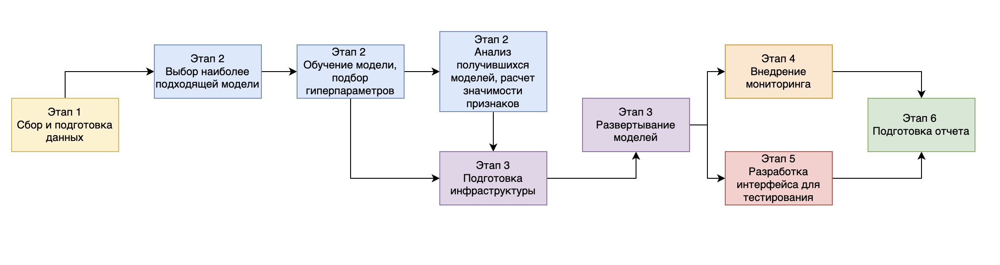
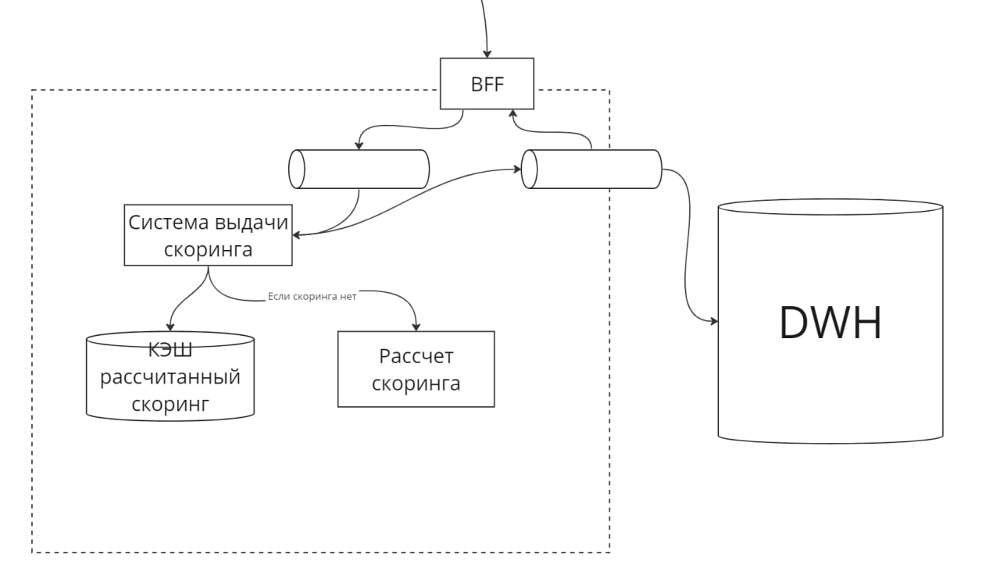
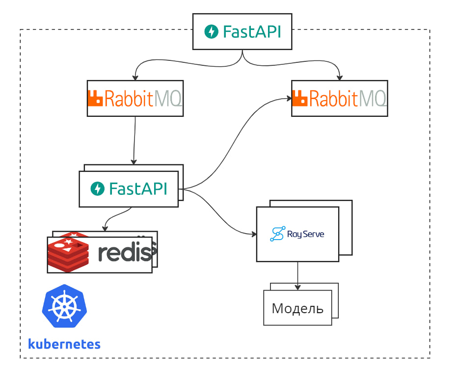

# ML System Design Doc - [RU]
## Дизайн ML системы - API-сервис скоринга заемщиков

> ## Термины и пояснения
> - Итерация - это все работы, которые совершаются до старта очередного пилота
> - БТ - бизнес-требования
> - EDA - Exploratory Data Analysis - исследовательский анализ данных

### 1. Цели и предпосылки
#### 1.1. Обоснованность разработки продукта

`Бизнес-цель` - автоматизация работы андеррайтеров в банке для:
- Определения надежности клиента (скоринг)
- Увеличение скорости принятия решения

##### Текущий бизнес-процесс
Компания `ОБЫЧНЫЙ БАНК` представляет финансовые услуги. Текущий процесс принятия решения по заемщику - это ручной андеррайтинг заемщика в отделении банка.
##### Польза от внедрения ML
С помощью внедрения сервиса:
- Увеличится скорость принятия решения
- Увеличится точность принятия решения, снизятся риски
- Сократится нагрузка на андеррайтеров
##### Критерии успеха
- Модели обладают разделяющей способностью большей, чем андеррайтер; >= 40 Gini.

Некорректный прогноз означает увеличение потерь в результате невозврата кредитов недобросовестными заемщиками.

- Разработаны модели для двух основных банковских продуктов
- Скорость обработки заявки <= 10 сек.

#### 1.2. Бизнес-требования и ограничения

- Краткое описание бизнес-требований:
Система должна проводить оценку заемщиков на основе различных факторов, таких как история кредитования, финансовое положение, стабильность дохода и другие сведения.
Система скоринга должна способствовать прогнозированию вероятности возврата кредита заемщиком в установленные сроки. Для модели известны наиболее важные признаки с точки зрения модели при принятии решения.

- Бизнес-ограничения:
Система должна оперативно принимать решения, соблюдая установленные сроки, чтобы обеспечивать оперативность предоставления финансовых услуг.
Система должна стремиться к минимизации ошибок в принятии решений, чтобы избежать отказов кредитования тем, кто является надежным заемщиком.
Баланс между точностью модели и предотвращением ложных отказов должен быть настроен для поддержания клиентского опыта и соблюдения требований регулирования.
Система должна соответствовать законодательству и нормативам, регулирующим предоставление финансовых услуг и использование данных о клиентах.

##### Результат итерации
- Разработан API-сервис
- Разработаны модели
- Разработана система мониторинга моделей

##### Описание бизнес-процесса пилота
Пилот будет использоваться в системе принятия решений банка и будет встроен в кредитный конвейер. По идентификатору клиента будет собираться кредитная история и другие признаки клиента, далее собранные данные подаются в систему. Система должна принимать файлы в формате JSON и отдавать ответы от моделей.
Каждая из моделей должна быть доступна по уникальному URL.
Для пилота будут использоваться данные `ОБЫЧНОГО БАНКА` по погашенным и неплатежеспособным кредитам, дата взятия которых больше максимальной даты в выборке используемой при разработке.
На входе: идентификатор клиента, заявочные данные.
На выходе: вероятность возрата кредита.

##### Возможные пути развития проекта
Дальнейшим развитием проекта будет являться построение моделей для других продуктов и улучшение их точности.

#### 1.3. Что входит в скоуп проекта/итерации, что не входит

- На закрытие каких БТ подписываемся в данной итерации:
Разработка моделей прогнозированию вероятности возврата кредита в установленные сроки на основе различных данных о заемщике.  Создание инфраструктуры для доступа к моделям. Разработка системы мониторинга.
- Что не будет закрыто:
Для поддержания актуальности моделей, обычно используются автоматические системы переобучения. Разработка такой системы не входит в скоуп проекта и является дальнейшим улучшением.
- Описание результата с точки зрения качества кода и воспроизводимости решения
    - Результатом будет структурированный, соответствующий общепринятым правилам, код. Решение должно быть воспроизводимым, что будет достигаться путем фиксирования параметров и результатов экспериментов.
- Описание планируемого технического долга: оптимизация алгоритмов для повышения их эффективности и интерпретируемости

#### 1.4. Предпосылки решения

- Описание всех общих предпосылок решения, используемых в системе – с обоснованием от запроса бизнеса: какие блоки данных используем, горизонт прогноза, гранулярность модели, и др.
    - В качестве данных будем использовать кредитную историю, информацию о запросах кредитной истории, социально-демографические признаки клиентов.
    - Горизонт прогноза - 2-3 года.
    - Модель будет работать на уровне отдельного клиента
    - Мониторинг работы и анализ результатов необходим для своевременной калибровки моделей

### 2. Методология

#### 2.1. Постановка задачи

Создание прогнозных моделей(задача классификации) и инфраструктуры для доступа к ним.

#### 2.2. Блок-схема решения

#### 2.3. Этапы решения задачи `Data Scientist`

- Этап 1 - Сбор и подготовка данных

На входе: базы данных с заявками на кредит, агрегатами на основе кредитной истории.

На данном этапе происходит сбор, предобработка, генерация новых признаков. В качестве исходных данных будем использовать кредитную историю, информацию о запросах кредитной истории, социально-демографические признаки клиентов.
Данные объединяюся в одну таблицу по идентификатору.
| Признак/Группа признаков| Описание                    |
|-------------------------|-----------------------------|
| date                    | Дата                        |
| D                       | Целевые переменные          |
| type                    | Тип                         |
| sum                     | Сумма кредита               |
| app_info                | Заявочная информация        |
| internals               | Внутренние предикторы       |
| e_req_vars              | Кредитная история           |
| e_ch_vars               | Запросы кредитной истории   |

Результатом данного этапа должны быть полностью подготовленные для разработки моделей массивы данных.

(EDA в отдельном файле с расширением .ipynb)

- Этап 2 - Разработка прогнозных моделей

На входе: csv файл с выборкой для разработки

Логирование разработки будет осуществляться с помощью WandB. WandB (Weights and Biases) - это инструмент для визуализации и отслеживания экспериментов в машинном обучении. Он предоставляет удобный интерфейс для записи метрик, графиков, изображений и других данных, связанных с обучением моделей.
На данном этапе следует начать с выбора наиболее подходящей модели для задачи. Среди семейств моделей планируется использовать логистическую регрессию в качестве бейзлайна и различные реализации градиентного бустинга на решающих деревьях как основную модель.

Затем данные будут разделены на тренировочный, валидационный и тестовый наборы с обязательной фиксацией random seed для обеспечения воспроизводимости результатов.

В качестве бейзлайна обучим логистическую регрессию.

Далее будет проведено обучение основной модели. Возможные библиотеки: xgboost и catboost.
XGBoost - библиотека градиентного бустинга, известная своей высокой производительностью и способностью эффективно обрабатывать различные типы данных, включая пропущенные значения.
CatBoost - оптимизированная для работы с категориальными признаками библиотека градиентного бустинга, обеспечивая высокую производительность и удобство использования.

Также необходимо подобрать оптимальные гиперпараметры. Их будем подбирать с помощью optuna.
Optuna - библиотека для автоматизации оптимизации гиперпараметров в машинном обучении, отличающаяся универсальностью, простым синтаксисом, встроенными инструментами визуализации и поддержкой распределенного обучения.

Оценивать модели будем с помощью метрики Gini:

$Gini_{normalized} = 2 * AUCROC - 1 \hspace{15pt}$

$AUCROC = \frac{\sum_{i=1}^{n_1} \sum_{j=1}^{n_0} S(x_i, x_j)}{n_1*n_0} \hspace{15pt}$

| S(x_i, x_j) | Условие             |
|-------------|---------------------|
| 1           | если \(x_i > x_j\)  |
| 1/2         | если \(x_i = x_j\)  |
| 0           | если \(x_i < x_j\)  |

где $x_i$ — ответ алгоритма на i-ом объекте из распределения «1», $x_j$ — ответ алгоритма на j-ом объекте из распределения «0»

Метрика Gini измеряет степень неравномерности распределения между классами, что в контексте кредитного скоринга означает различие между клиентами, вернувшими кредит, и теми, кто не вернул.

Причины выбора метрики:
1) Чувствительность к неравномерности классов: Метрика Gini эффективно учитывает дисбаланс между клиентами, вернувшими и не вернувшими кредит, что является распространенной особенностью в банковском кредитном скоринге.

2) Интерпретируемость: Коэффициент Gini предоставляет легко интерпретируемую меру эффективности модели, основанную на ROC-кривой.

Связь данной метрики с бизнес-метриками:
Улучшение Gini может привести к оптимизации структуры кредитного портфеля, обеспечивая точную идентификацию клиентов с разными уровнями кредитного риска и, таким образом, снижая общий риск.
Также повышается эффективность стратегии выдачи кредитов, доходы максимизируются за счет точного выделения кредитоспособных клиентов.

Результатом данного этапа должны быть успешно разработанные модели (веса в формате pickle), которые помогут оценить кредитный риск клиентов.
- Этап 3 - Подготовка инфраструктуры для развертывания моделей

На данном этапе осуществляется конфигурация инфраструктуры для развертывания моделей в форме API-сервиса в рамках Kubernetes инфраструктуры с использованием Nginx в качестве прокси и RayService в качестве сервиса управления моделями.

Шаги этапа включают:

- Конфигурация Kubernetes: Настройка кластера Kubernetes для размещения и управления контейнерами, в которых будут развертываться модели. Это включает в себя определение и настройку ресурсов, таких как поды, службы, и другие компоненты Kubernetes.

- Развертывание Nginx в качестве прокси: Создание конфигурации Nginx для обеспечения балансировки нагрузки и проксирования запросов к развернутым моделям внутри кластера. Настройка SSL и других параметров безопасности, если необходимо.

- Интеграция с RayService: Настройка интеграции с RayService, который предоставляет удобный интерфейс для управления и развертывания моделей. Это может включать в себя конфигурацию API-маршрутов, обеспечение аутентификации и авторизации для взаимодействия с RayService.

- Тестирование доступности API: Проведение тестирования доступности развернутых моделей через API, чтобы удостовериться в корректности их работы.

- Документация и обеспечение безопасности: Подготовка документации по API для пользователей и настройка мер безопасности, таких как управление доступом и аутентификация.

По завершении этапа должен быть обеспечен доступ к моделям по API через настроенную инфраструктуру, готовую к приему запросов и обеспечению высокой производительности системы.
- Этап 4 - Внедрение мониторинга работы сервиса

После развертывания моделей осуществляется конфигурация системы логирования для непрерывного мониторинга работы сервиса в реальном времени. На данной итерации используется простое логирование, позволяющее отслеживать ключевые события и производительность моделей. Это создает основу для будущих улучшений, таких как интеграция с более продвинутыми инструментами, например, Grafana.
Результатом данного этапа должна стать возможность увидеть логи работы сервиса.
- Этап 5 - Разработка интерфейса для тестирования моделей

Также необходим интерфейс для демонстрации работы сервиса. Он будет представлять собой сайт с помощью которого можно протестировать работу сервиса. На сайте будет доступна настройка наиболее важных параметров, и при нажатии кнопки отправки будет выдаваться вероятность дефолта.
Данный сайт используется исключительно для демонстрации и в пилоте участвовать не будет.
Сайт будет сделан с помощью streamlit. Streamlit - это библиотека для создания веб-приложений для анализа данных и визуализации, которая отличается простотой использования и быстротой разработки.
После отправки, сформируется json на основе введеных в поля значений и будет получена вероятность с помощью api запроса в сервис.
Результат данного этапа - работающий сайт для доступа к сервису.
- Этап 6 - Подготовка финального отчета для бизнеса

На данном этапе формируется отчет, который предоставит бизнесу всю необходимую информацию о разработанной системе. Отчет будет содержать результаты тестирования моделей, мониторинга работы сервиса и рекомендации для дальнейшего развития проекта, включая увеличение количества моделей и улучшение их точности.
Результатом данного этапа должен стать отчет.

### 3. Подготовка пилота

#### 3.1. Способ оценки пилота

В качестве оценки пилота буден проведен скоринг тестового набора данных, в результате должны быть достигнуты определенные значения метрик. Также будет проверена работа сервиса под нагрузкой.

#### 3.2. Что считаем успешным пилотом

По завершению теста принимаем решение.
Успешным проведение пилота считается при условиях:
- Метрика GINI на тестовом наборе больше 40 пунктов;
- Сервис выдерживает нагрузку 3 одновременных запроса в секунду;
- Скорость обработки запроса меньше 10 секунд.

### 4. Внедрение
#### 4.1. Архитектура решения

На блок-схеме выше представлена архитектурная схема решения.

Выдача скоринга происходит следующим образом:

- BFF отправляет сообщение на шину 1 данных c json. 
- Система выдачи скорингов, чтобы избежать повторного рассчета скоринга, сначала обращается к кэшу:
    - Если данные есть в кэше, система отправляет на шину 2 сообщение с рассчитанным скорингом.
    - Если данных нет, обращается к сервису "рассчет скоринга" рассчитывает скоринг для пользователя и отправляет сообщение с рассчитанным скорингом на шину 2. Рассчитанный скоринг сохраняется в кэш.
- BFF читает сообщение с шины 2 и передает ответ пользователю.
- Ответ сохраняется в хранилище DWH.

#### 4.2. Описание инфраструктуры и масштабируемости

Инфраструктура реализована в рамках кубернетес кластера. В качестве очереди используется rabbitmq, http-сервисы реализованы с помощью fastapi, кэш реализуется с помошью reddis, rayserve - система управления и монитринга моделей.

##### Плюсы
 - Kubernetes позволяет быстро подключать дополнительные вычислительные ноды.
 - Rayservice позволяет быстро масштабировать модели в новые ноды.
 - При этом, работа DevOps при настроенном CI/CD минимальна.

##### Минусы
 - К минусам можно отнести необходимость иметь в штате специалистов DevOps обладающих квалификацией работы с Kubernetes.
 - Кроме того, необходимы DevOps с навыками GitOps для настройки CI/CD.
 - Накладные расходы на поддержание кластера могут быть достаточно высокими.

##### Обоснование выбора
 - Выбор данной архитектуры обусловлен необходимостью дальнейшей масштабируемости и добавления новых моделей в зоопарк моделей банка. Kubernetes позволит незаметно для пользователей подключать дополнительные мощности в кластер. RayServe позволит добавлять и обновлять модели с помощью простого API.

##### Требования к железу и планируемое масштабирование
Для работы системы необходимы:
- Для BFF 2 ГБ ЦПУ
- Для системы выдачи скоринга 2 ГБ ЦПУ на каждую копию
- Для кэша 8 ГБ ЦПУ 10 ГБ памяти на каждую копию reddis
- Для системы рассчёта скоринга 2 ГБ ЦПУ для head-ноды и 512 - ... для каждой копии модели

Таким образом масштабирование системы происходит в зависимости от общей нагрузки на систему (увеличение копий reddis и систем выдачи скоринга) и нагрузки на модель (увеличение количества копий модели)

#### 4.3. Безопасность системы

- В данной версии пилота в ЭндПоинты системы не добалена аутентификация. Это может повлечь потенциальные уязвимости системы.

#### 4.4. Integration points

api системы представлено в [swagger.yaml формате](./swagger/swagger_api_design.yaml)

#### 4.5. Риски

- Риски могут заключатся в изменении кредитной стратегии банка, проведении рекламной компании и всему, что может привести к изменению клиентского потока, и следовательно, смещению признаков моделей и увеличению ошибок. 
- Решается добавлением мониторнга данных и ответов моделей и настройкой уведомлений.

#### 4.6 Способы масштабирования сервиса

- Сервис масштабируется с помощью дополнительных контейнеров и добавление дополнительных нод под эти контейнере в кластере. 

- Бутылочными горлышками могут быть сервисы reddis, модели. Решается добавлением новых контейнеров.

#### 4.7 Результаты НТ

- Дополнительный критерий о масштабируемости сервиса. Позволяет наглядно увидеть, как сервис реагирует на масштабирование. В результатах сервиса описаны сценарии нагрузки, сравнение времени отклика для каждого сценария, способы и сетап НТ.

НТ будем проводить с помощью библиотке Locust. Locust - это пакет Python, предназначенный для тестирования производительности и масштабируемости веб-приложений.

Определим тестовый сценарий. Укажем то, что наш клиент будет выполнять с нашим сервером. В нашем случае это довольно просто — клиент отправит нам запрос с информацией (в формате json) о предсказание дефолта на 24 и на 36 месяцах, и получит ответ от наших двух развёрнутых моделей.

Проведем стресс-тестирования укажем, что число клиентов обращающий к нашему сервису дойдет до 1000

Результаты

_1702823995.png)

Критическая точка нашего сервера составляет ~ 200 одновременных пользователей.

Продробный отчет в формате [html](/reports/report_1702323226.749415.html)
