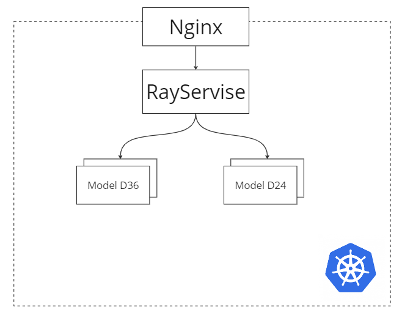

# ML System Design Doc - [RU]
## Дизайн ML системы - API-сервис скоринга заемщиков

> ## Термины и пояснения
> - Итерация - это все работы, которые совершаются до старта очередного пилота
> - БТ - бизнес-требования
> - EDA - Exploratory Data Analysis - исследовательский анализ данных

### 1. Цели и предпосылки
#### 1.1. Обоснованность разработки продукта

`Бизнес-цель` - автоматизация работы андеррайтеров в банке для:
- Определения надежности клиента (скоринг)
- Увеличение скорости принятия решения

##### Текущий бизнес-процесс
Компания `ОБЫЧНЫЙ БАНК` представляет финансовые услуги. Текущий процесс принятия решения по заемщику - это ручной андеррайтинг заемщика в отделении банка.
##### Польза от внедрения ML
С помощью внедрения сервиса:
- Увеличится скорость принятия решения
- Увеличится точность принятия решения, снизятся риски
- Сократится нагрузка на андеррайтеров
##### Критерии успеха
- Модели обладают разделяющей способностью большей, чем андеррайтер; >= 40 Gini.

Некорректный прогноз означает увеличение потерь в результате невозврата кредитов недобросовестными заемщиками.

- Разработаны модели для двух основных банковских продуктов
- Скорость обработки заявки <= 10 сек.

#### 1.2. Бизнес-требования и ограничения

- Краткое описание бизнес-требований:
Система должна проводить оценку заемщиков на основе различных факторов, таких как история кредитования, финансовое положение, стабильность дохода и другие сведения.
Система скоринга должна способствовать прогнозированию вероятности возврата кредита заемщиком в установленные сроки. Для модели известны наиболее важные признаки с точки зрения модели при принятии решения.

- Бизнес-ограничения:
Система должна оперативно принимать решения, соблюдая установленные сроки, чтобы обеспечивать оперативность предоставления финансовых услуг.
Система должна стремиться к минимизации ошибок в принятии решений, чтобы избежать отказов кредитования тем, кто является надежным заемщиком.
Баланс между точностью модели и предотвращением ложных отказов должен быть настроен для поддержания клиентского опыта и соблюдения требований регулирования.
Система должна соответствовать законодательству и нормативам, регулирующим предоставление финансовых услуг и использование данных о клиентах.

##### Результат итерации
- Разработан API-сервис
- Разработаны модели
- Разработана система мониторинга моделей

##### Описание бизнес-процесса пилота
Пилот будет использоваться в системе принятия решений банка и будет встроен в кредитный конвейер. По идентификатору клиента будет собираться кредитная история и другие признаки клиента, далее собранные данные подаются в систему. Система должна принимать файлы в формате JSON и отдавать ответы от моделей.
Каждая из моделей должна быть доступна по уникальному URL.
Для пилота будут использоваться данные `ОБЫЧНОГО БАНКА` по погашенным и неплатежеспособным кредитам, дата взятия которых больше максимальной даты в выборке используемой при разработке.
На входе: идентификатор клиента, заявочные данные.
На выходе: вероятность возрата кредита.

##### Возможные пути развития проекта
Дальнейшим развитием проекта будет являться построение моделей для других продуктов и улучшение их точности.

#### 1.3. Что входит в скоуп проекта/итерации, что не входит

- На закрытие каких БТ подписываемся в данной итерации:
Разработка моделей прогнозированию вероятности возврата кредита в установленные сроки на основе различных данных о заемщике.  Создание инфраструктуры для доступа к моделям. Разработка системы мониторинга.
- Что не будет закрыто:
Для поддержания актуальности моделей, обычно используются автоматические системы переобучения. Разработка такой системы не входит в скоуп проекта и является дальнейшим улучшением.
- Описание результата с точки зрения качества кода и воспроизводимости решения
    - Результатом будет структурированный, соответствующий общепринятым правилам, код. Решение должно быть воспроизводимым, что будет достигаться путем фиксирования параметров и результатов экспериментов.
- Описание планируемого технического долга: оптимизация алгоритмов для повышения их эффективности и интерпретируемости

#### 1.4. Предпосылки решения

- Описание всех общих предпосылок решения, используемых в системе – с обоснованием от запроса бизнеса: какие блоки данных используем, горизонт прогноза, гранулярность модели, и др.
    - В качестве данных будем использовать кредитную историю, информацию о запросах кредитной истории, социально-демографические признаки клиентов.
    - Горизонт прогноза - 1 год.
    - Модель будет работать на уровне отдельного клиента
    - Мониторинг работы и анализ результатов необходим для своевременной калибровки моделей

### 2. Методология

#### 2.1. Постановка задачи

Создание прогнозных моделей(задача классификации) и инфраструктуры для доступа к ним.

#### 2.2. Блок-схема решения

#### 2.3. Этапы решения задачи `Data Scientist`

- Этап 1 - Сбор и подготовка данных

На данном этапе происходит сбор, предобработка, генерация новых признаков. В качестве исходных данных будем использовать кредитную историю, информацию о запросах кредитной истории, социально-демографические признаки клиентов.
Результатом данного этапа должны быть полностью подготовленные для разработки моделей массивы данных.
- Этап 2 - Разработка прогнозных моделей

На данном этапе следует начать с выбора наиболее подходящей модели для задачи. Затем данные будут разделены на тренировочный, валидационный и тестовый наборы с обязательной фиксацией random seed для обеспечения воспроизводимости результатов. Далее будет проведено обучение модели и подбор гиперпараметров.

Оценивать модели будем с помощью метрики Gini:

$Gini_{normalized} = 2 * AUCROC - 1 \hspace{15pt}$

$AUCROC = \frac{\sum_{i=1}^{n_1} \sum_{j=1}^{n_0} S(x_i, x_j)}{n_1*n_0} \hspace{15pt}$

$S(x_i, x_j) = \begin{cases} 1, & \text{если } x_i > x_j\\ \frac{1}{2}, & \text{если } x_i = x_j \\ 0, & \text{если } x_i < x_j \end{cases}$

где $x_i$ — ответ алгоритма на i-ом объекте из распределения «1», $x_j$ — ответ алгоритма на j-ом объекте из распределения «0»

Метрика Gini измеряет степень неравномерности распределения между классами, что в контексте кредитного скоринга означает различие между клиентами, вернувшими кредит, и теми, кто не вернул.

Причины выбора метрики:
1) Чувствительность к неравномерности классов: Метрика Gini эффективно учитывает дисбаланс между клиентами, вернувшими и не вернувшими кредит, что является распространенной особенностью в банковском кредитном скоринге.

2) Интерпретируемость: Коэффициент Gini предоставляет легко интерпретируемую меру эффективности модели, основанную на ROC-кривой.

Связь данной метрики с бизнес-метриками:
Улучшение Gini может привести к оптимизации структуры кредитного портфеля, обеспечивая точную идентификацию клиентов с разными уровнями кредитного риска и, таким образом, снижая общий риск.
Также повышается эффективность стратегии выдачи кредитов, доходы максимизируются за счет точного выделения кредитоспособных клиентов.

Результатом данного этапа должны быть успешно разработанные модели, которые помогут оценить кредитный риск клиентов.
- Этап 3 - Подготовка инфраструктуры для развертывания моделей

Данный этап заключается в подготовке инфраструктуры для развертывания моделей в виде API-сервиса. Это включает в себя настройку серверов и поднятие кластеров.
В результате данного этапа должен появиться доступ к моделям по API.
- Этап 4 - Внедрение мониторинга работы сервиса

После развертывания моделей необходимо произвести настройку мониторинга и логирования работы сервиса. Это позволит отслеживать производительность моделей в реальном времени и реагировать на возникающие проблемы.
Результатом данного этапа должна стать система мониторинга сервиса.
- Этап 5 - Разработка интерфейса для тестирования моделей

Также необходим интерфейс для тестирования работы сервиса. Он будет представлять собой телеграмм-бот с помощью которого можно будет получить доступ к сервису.
Результат данного этапа - работающий телеграмм-бот для доступа к сервису.
- Этап 6 - Подготовка финального отчета для бизнеса

На данном этапе формируется отчет, который предоставит бизнесу всю необходимую информацию о разработанной системе. Отчет будет содержать результаты тестирования моделей, мониторинга работы сервиса и рекомендации для дальнейшего развития проекта, включая увеличение количества моделей и улучшение их точности.

### 3. Подготовка пилота

#### 3.1. Способ оценки пилота

В качестве оценки пилота буден проведен скоринг тестового набора данных, в результате должны быть достигнуты определенные значения метрик. Также будет проверена работа сервиса под нагрузкой.

#### 3.2. Что считаем успешным пилотом

По завершению теста принимаем решение.
Успешным проведение пилота считается при условиях:
- Метрика GINI на тестовом наборе больше 40 пунктов;
- Сервис выдерживает нагрузку 3 одновременных запроса в секунду;
- Скорость обработки запроса меньше 10 секунд.

### 4. Внедрение
#### 4.1. Архитектура решения

На блок-схеме выше представлена инфраструктурная схема решения.
Сервис разворачивается в рамках Kubernetes инфраструктуры.

В качестве proxy используется Nginx.
В качестве сервиса управления моделями используется RayService.

#### 4.2. Описание инфраструктуры и масштабируемости

##### Плюсы
 - Kubernetes позволяет быстро подключать дополнительные вычислительные ноды.
 - Rayservice позволяет быстро масштабировать модели в новые ноды.
 - При этом, работа DevOps при настроенном CI/CD минимальна.

##### Минусы
 - К минусам можно отнести необходимость иметь в штате специалистов DevOps обладающих квалификацией работы с Kubernetes.
 - Кроме того, необходимы DevOps с навыками GitOps для настройки CI/CD.
 - Накладные расходы на поддержание кластера могут быть достаточно высокими.

##### Обоснование выбора
 - Выбор данной архитектуры обусловлен необходимостью дальнейшей масштабируемости и добавления новых моделей в зоопарк моделей банка. Kubernetes позволит незаметно для пользователей подключать дополнительные мощности в кластер. RayServe позволит добавлять и обновлять модели с помощью простого API.

#### 4.3. Требования к работе системы

- SLA, пропускная способность и задержка `Data Scientist`

#### 4.4. Безопасность системы

- В данной версии пилота в ЭндПоинты системы не добалена аутентификация. Это может повлечь потенциальные уязвимости системы.

#### 4.5. Безопасность данных

- Нет ли нарушений GDPR и других законов `Data Scientist`

#### 4.6. Издержки

- Расчетные издержки на работу системы в месяц `Data Scientist`

#### 4.5. Integration points

Ниже в таблице описаны методы API системы
| №                                         | EndPoint    | Request                    |
| ----------------------------------------- | ----------- | -------------------------- |
| Variable/Dtype                            | Description |
| 1                                         | D_24_MODEL  |
|     sum: typing.Optional[float]           |             |
|     internals_0: typing.Optional[int]     |             |
|     internals_1: typing.Optional[float]   |             |
|     internals_2: typing.Optional[float]   |             |
|     internals_3: typing.Optional[float]   |             |
|     internals_4: typing.Optional[float]   |             |
|     app_info_0: typing.Optional[float]    |             |
|     app_info_1: typing.Optional[float]    |             |
|     app_info_2: typing.Optional[float]    |             |
|     app_info_3: typing.Optional[float]    |             |
|     app_info_4: typing.Optional[float]    |             |
|     app_info_6: typing.Optional[float]    |             |
|     app_info_7: typing.Optional[float]    |             |
|     app_info_8: typing.Optional[float]    |             |
|     app_info_9: typing.Optional[float]    |             |
|     app_info_10: typing.Optional[float]   |             |
|     e_req_vars_0: typing.Optional[float]  |             |
|     e_req_vars_1: typing.Optional[float]  |             |
|     e_req_vars_2: typing.Optional[float]  |             |
|     e_req_vars_3: typing.Optional[float]  |             |
|     e_req_vars_4: typing.Optional[float]  |             |
|     e_req_vars_5: typing.Optional[float]  |             |
|     e_req_vars_6: typing.Optional[float]  |             |
|     e_req_vars_7: typing.Optional[float]  |             |
|     e_req_vars_8: typing.Optional[float]  |             |
|     e_req_vars_9: typing.Optional[float]  |             |
|     e_req_vars_10: typing.Optional[float] |             |
|     e_req_vars_11: typing.Optional[float] |             |
|     e_req_vars_12: typing.Optional[float] |             |
|     e_req_vars_13: typing.Optional[float] |             |
|     e_req_vars_14: typing.Optional[float] |             |
|     e_req_vars_15: typing.Optional[float] |             |
|     e_req_vars_16: typing.Optional[float] |             |
|     e_req_vars_17: typing.Optional[float] |             |
|     e_req_vars_18: typing.Optional[float] |             |
|     e_req_vars_19: typing.Optional[float] |             |
|     e_req_vars_20: typing.Optional[float] |             |
|     e_req_vars_21: typing.Optional[float] |             |
|     e_req_vars_22: typing.Optional[float] |             |
|     e_req_vars_23: typing.Optional[float] |             |
|     e_req_vars_24: typing.Optional[float] |             |
|     e_req_vars_25: typing.Optional[float] |             |
|     e_req_vars_26: typing.Optional[float] |             |
|     e_req_vars_27: typing.Optional[float] |             |
|     e_req_vars_28: typing.Optional[float] |             |
|     e_req_vars_29: typing.Optional[float] |             |
|     e_req_vars_30: typing.Optional[float] |             |
|     e_req_vars_31: typing.Optional[float] |             |
|     e_req_vars_32: typing.Optional[float] |             |
|     e_req_vars_33: typing.Optional[float] |             |
|     e_req_vars_34: typing.Optional[float] |             |
|     e_req_vars_35: typing.Optional[float] |             |
|     e_req_vars_36: typing.Optional[float] |             |
|     e_req_vars_37: typing.Optional[float] |             |
|     e_req_vars_38: typing.Optional[float] |             |
|     e_req_vars_39: typing.Optional[float] |             |
|     e_req_vars_40: typing.Optional[float] |             |
|     e_req_vars_41: typing.Optional[float] |             |
|     e_req_vars_42: typing.Optional[float] |             |
|     e_req_vars_43: typing.Optional[float] |             |
|     e_req_vars_44: typing.Optional[float] |             |
|     e_req_vars_45: typing.Optional[float] |             |
|     e_req_vars_46: typing.Optional[float] |             |
|     e_req_vars_47: typing.Optional[float] |             |
|     e_req_vars_48: typing.Optional[float] |             |
|     e_req_vars_49: typing.Optional[float] |             |
|     e_req_vars_50: typing.Optional[float] |             |
|     e_req_vars_51: typing.Optional[float] |             |
|     e_req_vars_52: typing.Optional[float] |             |
|     e_req_vars_53: typing.Optional[float] |             |
|     e_req_vars_54: typing.Optional[float] |             |
|     e_req_vars_55: typing.Optional[float] |             |
|     e_req_vars_56: typing.Optional[float] |             |
|     e_req_vars_57: typing.Optional[float] |             |
|     e_req_vars_58: typing.Optional[float] |             |
|     e_req_vars_59: typing.Optional[float] |             |
|     e_req_vars_60: typing.Optional[float] |             |
|     e_req_vars_61: typing.Optional[float] |             |
|     e_req_vars_62: typing.Optional[float] |             |
|     e_req_vars_63: typing.Optional[float] |             |
|     e_req_vars_64: typing.Optional[float] |             |
|     e_req_vars_65: typing.Optional[float] |             |
|     e_req_vars_66: typing.Optional[float] |             |
|     e_req_vars_67: typing.Optional[float] |             |
|     e_req_vars_68: typing.Optional[float] |             |
|     e_req_vars_69: typing.Optional[float] |             |
|     e_req_vars_70: typing.Optional[float] |             |
|     e_req_vars_71: typing.Optional[float] |             |
|     e_req_vars_72: typing.Optional[float] |             |
|     e_req_vars_73: typing.Optional[float] |             |
|     e_req_vars_74: typing.Optional[float] |             |
|     e_req_vars_75: typing.Optional[float] |             |
|     e_req_vars_76: typing.Optional[float] |             |
|     e_req_vars_77: typing.Optional[float] |             |
|     e_req_vars_78: typing.Optional[float] |             |
|     e_req_vars_79: typing.Optional[float] |             |
|     e_req_vars_80: typing.Optional[float] |             |
|     e_req_vars_81: typing.Optional[float] |             |
|     e_req_vars_82: typing.Optional[float] |             |
|     e_req_vars_83: typing.Optional[float] |             |
|     e_ch_vars_0: typing.Optional[float]   |             |
|     e_ch_vars_1: typing.Optional[float]   |             |
|     e_ch_vars_2: typing.Optional[float]   |             |
|     e_ch_vars_3: typing.Optional[float]   |             |
|     e_ch_vars_4: typing.Optional[float]   |             |
|     e_ch_vars_5: typing.Optional[float]   |             |
|     e_ch_vars_6: typing.Optional[float]   |             |
|     e_ch_vars_7: typing.Optional[float]   |             |
|     e_ch_vars_8: typing.Optional[float]   |             |
|     e_ch_vars_9: typing.Optional[float]   |             |
|     e_ch_vars_10: typing.Optional[float]  |             |
|     e_ch_vars_11: typing.Optional[float]  |             |
|     e_ch_vars_12: typing.Optional[float]  |             |
|     e_ch_vars_13: typing.Optional[float]  |             |
|     e_ch_vars_14: typing.Optional[float]  |             |
|     e_ch_vars_15: typing.Optional[float]  |             |
|     e_ch_vars_16: typing.Optional[float]  |             |
|     e_ch_vars_17: typing.Optional[float]  |             |
|     e_ch_vars_18: typing.Optional[float]  |             |
|     e_ch_vars_19: typing.Optional[float]  |             |
|     e_ch_vars_20: typing.Optional[float]  |             |
|     e_ch_vars_21: typing.Optional[float]  |             |
|     e_ch_vars_22: typing.Optional[float]  |             |
|     e_ch_vars_23: typing.Optional[float]  |             |
|     e_ch_vars_24: typing.Optional[float]  |             |
|     e_ch_vars_25: typing.Optional[float]  |             |
|     e_ch_vars_26: typing.Optional[float]  |             |
|     e_ch_vars_27: typing.Optional[float]  |             |
|     e_ch_vars_28: typing.Optional[float]  |             |
|     e_ch_vars_29: typing.Optional[float]  |             |
|     e_ch_vars_30: typing.Optional[float]  |             |
|     e_ch_vars_31: typing.Optional[float]  |             |
|     e_ch_vars_32: typing.Optional[float]  |             |
|     e_ch_vars_33: typing.Optional[float]  |             |
|     e_ch_vars_34: typing.Optional[float]  |             |
|     e_ch_vars_35: typing.Optional[float]  |             |
|     e_ch_vars_36: typing.Optional[float]  |             |
|     e_ch_vars_37: typing.Optional[float]  |             |
|     e_ch_vars_38: typing.Optional[float]  |             |
|     e_ch_vars_39: typing.Optional[float]  |             |
|     e_ch_vars_40: typing.Optional[float]  |             |
|     e_ch_vars_41: typing.Optional[float]  |             |
|     e_ch_vars_42: typing.Optional[float]  |             |
|     e_ch_vars_43: typing.Optional[float]  |             |
|     e_ch_vars_44: typing.Optional[float]  |             |
|     e_ch_vars_45: typing.Optional[float]  |             |
|     e_ch_vars_46: typing.Optional[float]  |             |
|     e_ch_vars_47: typing.Optional[float]  |             |
|     e_ch_vars_48: typing.Optional[float]  |             |
|     e_ch_vars_49: typing.Optional[float]  |             |
|     e_ch_vars_50: typing.Optional[float]  |             |
|     e_ch_vars_51: typing.Optional[float]  |             |
|     e_ch_vars_52: typing.Optional[float]  |             |
|     e_ch_vars_53: typing.Optional[float]  |             |
|     e_ch_vars_54: typing.Optional[float]  |             |
|     e_ch_vars_55: typing.Optional[float]  |             |
|     e_ch_vars_56: typing.Optional[float]  |             |
|     e_ch_vars_57: typing.Optional[float]  |             |
|     e_ch_vars_58: typing.Optional[float]  |             |
|     e_ch_vars_59: typing.Optional[float]  |             |
|     e_ch_vars_60: typing.Optional[float]  |             |
|     e_ch_vars_61: typing.Optional[float]  |             |
|     e_ch_vars_62: typing.Optional[float]  |             |
|     e_ch_vars_63: typing.Optional[float]  |             |
|     e_ch_vars_64: typing.Optional[float]  |             |
|     e_ch_vars_65: typing.Optional[float]  |             |
|     e_ch_vars_66: typing.Optional[float]  |             |
|     e_ch_vars_67: typing.Optional[float]  |             |
|     e_ch_vars_68: typing.Optional[float]  |             |
|     e_ch_vars_69: typing.Optional[float]  |             |
|     e_ch_vars_70: typing.Optional[float]  |             |
|     e_ch_vars_71: typing.Optional[float]  |             |
|     e_ch_vars_72: typing.Optional[float]  |             |
|     e_ch_vars_73: typing.Optional[float]  |             |
|     e_ch_vars_74: typing.Optional[float]  |             |
|     e_ch_vars_75: typing.Optional[float]  |             |
|     e_ch_vars_76: typing.Optional[float]  |             |
|     e_ch_vars_77: typing.Optional[float]  |             |
|     e_ch_vars_78: typing.Optional[float]  |             |
|     e_ch_vars_79: typing.Optional[float]  |             |
|     e_ch_vars_80: typing.Optional[float]  |             |
|     e_ch_vars_81: typing.Optional[float]  |             |
|     e_ch_vars_82: typing.Optional[float]  |             |
|     e_ch_vars_83: typing.Optional[float]  |             |
|     e_ch_vars_84: typing.Optional[float]  |             |
|     e_ch_vars_85: typing.Optional[float]  |             |
|     e_ch_vars_86: typing.Optional[float]  |             |
|     e_ch_vars_87: typing.Optional[float]  |             |
|     e_ch_vars_88: typing.Optional[float]  |             |
|     e_ch_vars_89: typing.Optional[float]  |             |
|     e_ch_vars_90: typing.Optional[float]  |             |
|     e_ch_vars_91: typing.Optional[float]  |             |
|     e_ch_vars_92: typing.Optional[float]  |             |
|     e_ch_vars_93: typing.Optional[float]  |             |
|     e_ch_vars_94: typing.Optional[float]  |             |
|     e_ch_vars_95: typing.Optional[float]  |             |
|     e_ch_vars_96: typing.Optional[float]  |             |
|     e_ch_vars_97: typing.Optional[float]  |             |
|     e_ch_vars_98: typing.Optional[float]  |             |
|     e_ch_vars_99: typing.Optional[float]  |             |
|     e_ch_vars_100: typing.Optional[float] |             |
|     e_ch_vars_101: typing.Optional[float] |             |
|     e_ch_vars_102: typing.Optional[float] |             |
|     e_ch_vars_103: typing.Optional[float] |             |
|     e_ch_vars_104: typing.Optional[float] |             |
|     e_ch_vars_105: typing.Optional[float] |             |
|     e_ch_vars_106: typing.Optional[float] |             |
|     e_ch_vars_107: typing.Optional[float] |             |
|     e_ch_vars_108: typing.Optional[float] |             |
|     e_ch_vars_109: typing.Optional[float] |             |
|     e_ch_vars_110: typing.Optional[float] |             |
|     e_ch_vars_111: typing.Optional[float] |             |
|     e_ch_vars_112: typing.Optional[float] |             |
|     e_ch_vars_113: typing.Optional[float] |             |
|     e_ch_vars_114: typing.Optional[float] |             |
|     e_ch_vars_115: typing.Optional[float] |             |
|     e_ch_vars_116: typing.Optional[float] |             |
|     e_ch_vars_117: typing.Optional[float] |             |
|     e_ch_vars_118: typing.Optional[float] |             |
|     e_ch_vars_119: typing.Optional[float] |             |
|     e_ch_vars_120: typing.Optional[float] |             |
|     e_ch_vars_121: typing.Optional[float] |             |
|     e_ch_vars_122: typing.Optional[float] |             |
|     e_ch_vars_123: typing.Optional[float] |             |
|     e_ch_vars_124: typing.Optional[float] |             |
|     e_ch_vars_125: typing.Optional[float] |             |
|     e_ch_vars_126: typing.Optional[float] |             |
|     e_ch_vars_127: typing.Optional[float] |             |
|     e_ch_vars_128: typing.Optional[float] |             |
|     e_ch_vars_129: typing.Optional[float] |             |
|     e_ch_vars_130: typing.Optional[float] |             |
|     e_ch_vars_131: typing.Optional[float] |             |
|     e_req_vars_84: typing.Optional[float] |             |
|     e_req_vars_85: typing.Optional[float] |             |
|     e_req_vars_86: typing.Optional[float] |             |
|     e_req_vars_87: typing.Optional[float] |             |
|     e_ch_vars_132: typing.Optional[float] |             |
| 2                                         | D_36_MODEL  |
|     sum: typing.Optional[float]           |             |
|     internals_0: typing.Optional[int]     |             |
|     internals_1: typing.Optional[float]   |             |
|     internals_2: typing.Optional[float]   |             |
|     internals_3: typing.Optional[float]   |             |
|     internals_4: typing.Optional[float]   |             |
|     app_info_0: typing.Optional[float]    |             |
|     app_info_1: typing.Optional[float]    |             |
|     app_info_2: typing.Optional[float]    |             |
|     app_info_3: typing.Optional[float]    |             |
|     app_info_4: typing.Optional[float]    |             |
|     app_info_6: typing.Optional[float]    |             |
|     app_info_7: typing.Optional[float]    |             |
|     app_info_8: typing.Optional[float]    |             |
|     app_info_9: typing.Optional[float]    |             |
|     app_info_10: typing.Optional[float]   |             |
|     e_req_vars_0: typing.Optional[float]  |             |
|     e_req_vars_1: typing.Optional[float]  |             |
|     e_req_vars_2: typing.Optional[float]  |             |
|     e_req_vars_3: typing.Optional[float]  |             |
|     e_req_vars_4: typing.Optional[float]  |             |
|     e_req_vars_5: typing.Optional[float]  |             |
|     e_req_vars_6: typing.Optional[float]  |             |
|     e_req_vars_7: typing.Optional[float]  |             |
|     e_req_vars_8: typing.Optional[float]  |             |
|     e_req_vars_9: typing.Optional[float]  |             |
|     e_req_vars_10: typing.Optional[float] |             |
|     e_req_vars_11: typing.Optional[float] |             |
|     e_req_vars_12: typing.Optional[float] |             |
|     e_req_vars_13: typing.Optional[float] |             |
|     e_req_vars_14: typing.Optional[float] |             |
|     e_req_vars_15: typing.Optional[float] |             |
|     e_req_vars_16: typing.Optional[float] |             |
|     e_req_vars_17: typing.Optional[float] |             |
|     e_req_vars_18: typing.Optional[float] |             |
|     e_req_vars_19: typing.Optional[float] |             |
|     e_req_vars_20: typing.Optional[float] |             |
|     e_req_vars_21: typing.Optional[float] |             |
|     e_req_vars_22: typing.Optional[float] |             |
|     e_req_vars_23: typing.Optional[float] |             |
|     e_req_vars_24: typing.Optional[float] |             |
|     e_req_vars_25: typing.Optional[float] |             |
|     e_req_vars_26: typing.Optional[float] |             |
|     e_req_vars_27: typing.Optional[float] |             |
|     e_req_vars_28: typing.Optional[float] |             |
|     e_req_vars_29: typing.Optional[float] |             |
|     e_req_vars_30: typing.Optional[float] |             |
|     e_req_vars_31: typing.Optional[float] |             |
|     e_req_vars_32: typing.Optional[float] |             |
|     e_req_vars_33: typing.Optional[float] |             |
|     e_req_vars_34: typing.Optional[float] |             |
|     e_req_vars_35: typing.Optional[float] |             |
|     e_req_vars_36: typing.Optional[float] |             |
|     e_req_vars_37: typing.Optional[float] |             |
|     e_req_vars_38: typing.Optional[float] |             |
|     e_req_vars_39: typing.Optional[float] |             |
|     e_req_vars_40: typing.Optional[float] |             |
|     e_req_vars_41: typing.Optional[float] |             |
|     e_req_vars_42: typing.Optional[float] |             |
|     e_req_vars_43: typing.Optional[float] |             |
|     e_req_vars_44: typing.Optional[float] |             |
|     e_req_vars_45: typing.Optional[float] |             |
|     e_req_vars_46: typing.Optional[float] |             |
|     e_req_vars_47: typing.Optional[float] |             |
|     e_req_vars_48: typing.Optional[float] |             |
|     e_req_vars_49: typing.Optional[float] |             |
|     e_req_vars_50: typing.Optional[float] |             |
|     e_req_vars_51: typing.Optional[float] |             |
|     e_req_vars_52: typing.Optional[float] |             |
|     e_req_vars_53: typing.Optional[float] |             |
|     e_req_vars_54: typing.Optional[float] |             |
|     e_req_vars_55: typing.Optional[float] |             |
|     e_req_vars_56: typing.Optional[float] |             |
|     e_req_vars_57: typing.Optional[float] |             |
|     e_req_vars_58: typing.Optional[float] |             |
|     e_req_vars_59: typing.Optional[float] |             |
|     e_req_vars_60: typing.Optional[float] |             |
|     e_req_vars_61: typing.Optional[float] |             |
|     e_req_vars_62: typing.Optional[float] |             |
|     e_req_vars_63: typing.Optional[float] |             |
|     e_req_vars_64: typing.Optional[float] |             |
|     e_req_vars_65: typing.Optional[float] |             |
|     e_req_vars_66: typing.Optional[float] |             |
|     e_req_vars_67: typing.Optional[float] |             |
|     e_req_vars_68: typing.Optional[float] |             |
|     e_req_vars_69: typing.Optional[float] |             |
|     e_req_vars_70: typing.Optional[float] |             |
|     e_req_vars_71: typing.Optional[float] |             |
|     e_req_vars_72: typing.Optional[float] |             |
|     e_req_vars_73: typing.Optional[float] |             |
|     e_req_vars_74: typing.Optional[float] |             |
|     e_req_vars_75: typing.Optional[float] |             |
|     e_req_vars_76: typing.Optional[float] |             |
|     e_req_vars_77: typing.Optional[float] |             |
|     e_req_vars_78: typing.Optional[float] |             |
|     e_req_vars_79: typing.Optional[float] |             |
|     e_req_vars_80: typing.Optional[float] |             |
|     e_req_vars_81: typing.Optional[float] |             |
|     e_req_vars_82: typing.Optional[float] |             |
|     e_req_vars_83: typing.Optional[float] |             |
|     e_ch_vars_0: typing.Optional[float]   |             |
|     e_ch_vars_1: typing.Optional[float]   |             |
|     e_ch_vars_2: typing.Optional[float]   |             |
|     e_ch_vars_3: typing.Optional[float]   |             |
|     e_ch_vars_4: typing.Optional[float]   |             |
|     e_ch_vars_5: typing.Optional[float]   |             |
|     e_ch_vars_6: typing.Optional[float]   |             |
|     e_ch_vars_7: typing.Optional[float]   |             |
|     e_ch_vars_8: typing.Optional[float]   |             |
|     e_ch_vars_9: typing.Optional[float]   |             |
|     e_ch_vars_10: typing.Optional[float]  |             |
|     e_ch_vars_11: typing.Optional[float]  |             |
|     e_ch_vars_12: typing.Optional[float]  |             |
|     e_ch_vars_13: typing.Optional[float]  |             |
|     e_ch_vars_14: typing.Optional[float]  |             |
|     e_ch_vars_15: typing.Optional[float]  |             |
|     e_ch_vars_16: typing.Optional[float]  |             |
|     e_ch_vars_17: typing.Optional[float]  |             |
|     e_ch_vars_18: typing.Optional[float]  |             |
|     e_ch_vars_19: typing.Optional[float]  |             |
|     e_ch_vars_20: typing.Optional[float]  |             |
|     e_ch_vars_21: typing.Optional[float]  |             |
|     e_ch_vars_22: typing.Optional[float]  |             |
|     e_ch_vars_23: typing.Optional[float]  |             |
|     e_ch_vars_24: typing.Optional[float]  |             |
|     e_ch_vars_25: typing.Optional[float]  |             |
|     e_ch_vars_26: typing.Optional[float]  |             |
|     e_ch_vars_27: typing.Optional[float]  |             |
|     e_ch_vars_28: typing.Optional[float]  |             |
|     e_ch_vars_29: typing.Optional[float]  |             |
|     e_ch_vars_30: typing.Optional[float]  |             |
|     e_ch_vars_31: typing.Optional[float]  |             |
|     e_ch_vars_32: typing.Optional[float]  |             |
|     e_ch_vars_33: typing.Optional[float]  |             |
|     e_ch_vars_34: typing.Optional[float]  |             |
|     e_ch_vars_35: typing.Optional[float]  |             |
|     e_ch_vars_36: typing.Optional[float]  |             |
|     e_ch_vars_37: typing.Optional[float]  |             |
|     e_ch_vars_38: typing.Optional[float]  |             |
|     e_ch_vars_39: typing.Optional[float]  |             |
|     e_ch_vars_40: typing.Optional[float]  |             |
|     e_ch_vars_41: typing.Optional[float]  |             |
|     e_ch_vars_42: typing.Optional[float]  |             |
|     e_ch_vars_43: typing.Optional[float]  |             |
|     e_ch_vars_44: typing.Optional[float]  |             |
|     e_ch_vars_45: typing.Optional[float]  |             |
|     e_ch_vars_46: typing.Optional[float]  |             |
|     e_ch_vars_47: typing.Optional[float]  |             |
|     e_ch_vars_48: typing.Optional[float]  |             |
|     e_ch_vars_49: typing.Optional[float]  |             |
|     e_ch_vars_50: typing.Optional[float]  |             |
|     e_ch_vars_51: typing.Optional[float]  |             |
|     e_ch_vars_52: typing.Optional[float]  |             |
|     e_ch_vars_53: typing.Optional[float]  |             |
|     e_ch_vars_54: typing.Optional[float]  |             |
|     e_ch_vars_55: typing.Optional[float]  |             |
|     e_ch_vars_56: typing.Optional[float]  |             |
|     e_ch_vars_57: typing.Optional[float]  |             |
|     e_ch_vars_58: typing.Optional[float]  |             |
|     e_ch_vars_59: typing.Optional[float]  |             |
|     e_ch_vars_60: typing.Optional[float]  |             |
|     e_ch_vars_61: typing.Optional[float]  |             |
|     e_ch_vars_62: typing.Optional[float]  |             |
|     e_ch_vars_63: typing.Optional[float]  |             |
|     e_ch_vars_64: typing.Optional[float]  |             |
|     e_ch_vars_65: typing.Optional[float]  |             |
|     e_ch_vars_66: typing.Optional[float]  |             |
|     e_ch_vars_67: typing.Optional[float]  |             |
|     e_ch_vars_68: typing.Optional[float]  |             |
|     e_ch_vars_69: typing.Optional[float]  |             |
|     e_ch_vars_70: typing.Optional[float]  |             |
|     e_ch_vars_71: typing.Optional[float]  |             |
|     e_ch_vars_72: typing.Optional[float]  |             |
|     e_ch_vars_73: typing.Optional[float]  |             |
|     e_ch_vars_74: typing.Optional[float]  |             |
|     e_ch_vars_75: typing.Optional[float]  |             |
|     e_ch_vars_76: typing.Optional[float]  |             |
|     e_ch_vars_77: typing.Optional[float]  |             |
|     e_ch_vars_78: typing.Optional[float]  |             |
|     e_ch_vars_79: typing.Optional[float]  |             |
|     e_ch_vars_80: typing.Optional[float]  |             |
|     e_ch_vars_81: typing.Optional[float]  |             |
|     e_ch_vars_82: typing.Optional[float]  |             |
|     e_ch_vars_83: typing.Optional[float]  |             |
|     e_ch_vars_84: typing.Optional[float]  |             |
|     e_ch_vars_85: typing.Optional[float]  |             |
|     e_ch_vars_86: typing.Optional[float]  |             |
|     e_ch_vars_87: typing.Optional[float]  |             |
|     e_ch_vars_88: typing.Optional[float]  |             |
|     e_ch_vars_89: typing.Optional[float]  |             |
|     e_ch_vars_90: typing.Optional[float]  |             |
|     e_ch_vars_91: typing.Optional[float]  |             |
|     e_ch_vars_92: typing.Optional[float]  |             |
|     e_ch_vars_93: typing.Optional[float]  |             |
|     e_ch_vars_94: typing.Optional[float]  |             |
|     e_ch_vars_95: typing.Optional[float]  |             |
|     e_ch_vars_96: typing.Optional[float]  |             |
|     e_ch_vars_97: typing.Optional[float]  |             |
|     e_ch_vars_98: typing.Optional[float]  |             |
|     e_ch_vars_99: typing.Optional[float]  |             |
|     e_ch_vars_100: typing.Optional[float] |             |
|     e_ch_vars_101: typing.Optional[float] |             |
|     e_ch_vars_102: typing.Optional[float] |             |
|     e_ch_vars_103: typing.Optional[float] |             |
|     e_ch_vars_104: typing.Optional[float] |             |
|     e_ch_vars_105: typing.Optional[float] |             |
|     e_ch_vars_106: typing.Optional[float] |             |
|     e_ch_vars_107: typing.Optional[float] |             |
|     e_ch_vars_108: typing.Optional[float] |             |
|     e_ch_vars_109: typing.Optional[float] |             |
|     e_ch_vars_110: typing.Optional[float] |             |
|     e_ch_vars_111: typing.Optional[float] |             |
|     e_ch_vars_112: typing.Optional[float] |             |
|     e_ch_vars_113: typing.Optional[float] |             |
|     e_ch_vars_114: typing.Optional[float] |             |
|     e_ch_vars_115: typing.Optional[float] |             |
|     e_ch_vars_116: typing.Optional[float] |             |
|     e_ch_vars_117: typing.Optional[float] |             |
|     e_ch_vars_118: typing.Optional[float] |             |
|     e_ch_vars_119: typing.Optional[float] |             |
|     e_ch_vars_120: typing.Optional[float] |             |
|     e_ch_vars_121: typing.Optional[float] |             |
|     e_ch_vars_122: typing.Optional[float] |             |
|     e_ch_vars_123: typing.Optional[float] |             |
|     e_ch_vars_124: typing.Optional[float] |             |
|     e_ch_vars_125: typing.Optional[float] |             |
|     e_ch_vars_126: typing.Optional[float] |             |
|     e_ch_vars_127: typing.Optional[float] |             |
|     e_ch_vars_128: typing.Optional[float] |             |
|     e_ch_vars_129: typing.Optional[float] |             |
|     e_ch_vars_130: typing.Optional[float] |             |
|     e_ch_vars_131: typing.Optional[float] |             |
|     e_req_vars_84: typing.Optional[float] |             |
|     e_req_vars_85: typing.Optional[float] |             |
|     e_req_vars_86: typing.Optional[float] |             |
|     e_req_vars_87: typing.Optional[float] |             |
|     e_ch_vars_132: typing.Optional[float] |             |

#### 4.6. Риски

- Описание рисков и неопределенностей, которые стоит предусмотреть `Data Scientist`

#### 4.7 Способы масштабирования сервиса

- Для каждой компоненты архитектуры описано, каким образом можно ее масштабировать. Также описаны потенциальные "бутылочные горлышки" системы - места, которые в будущем при увеличении нагрузки могут тормозить всю систему.

#### 4.8 Результаты НТ

- Дополнительный критерий о масштабируемости сервиса. Позволяет наглядно увидеть, как сервис реагирует на масштабирование. В результатах сервиса описаны сценарии нагрузки, сравнение времени отклика для каждого сценария, способы и сетап НТ.
